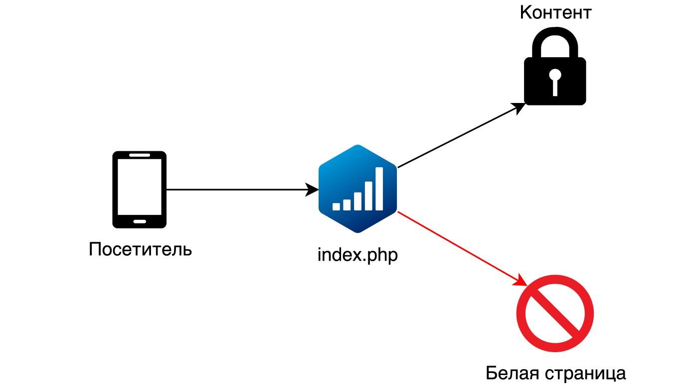
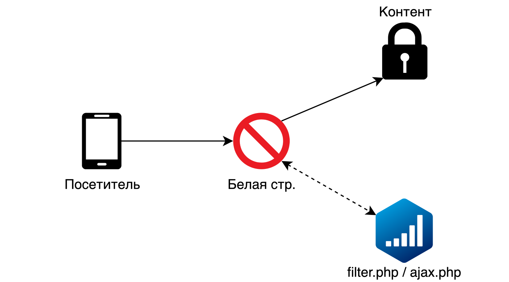

# Обзор

## Что такое Adspect

[**Adspect**](https://www.adspect.ai/) --- это простой в использовании облачный сервис, предназначенный для защиты
онлайн-рекламных кампаний (CPA-офферов, лэндингов) от нежелательного трафика. Под нежелательным трафиком мы понимаем:

* **модераторов рекламных сетей**
* [скликивание (кликфрод)](https://ru.wikipedia.org/wiki/%D0%9A%D0%BB%D0%B8%D0%BA%D1%84%D1%80%D0%BE%D0%B4),
  повсеместно распространенное в медийных рекламных сетях и popunder-сетях
* роботов spy-сервисов ("spy services" --- сервисы для отслеживания чужих рекламных кампаний)
* [роботов для веб-скрейпинга](https://ru.wikipedia.org/wiki/%D0%92%D0%B5%D0%B1-%D1%81%D0%BA%D1%80%D0%B5%D0%B9%D0%BF%D0%B8%D0%BD%D0%B3)
* [роботов для подбора паролей](https://en.wikipedia.org/wiki/Credential_stuffing)
* роботов антивирусных компаний
* и другие разновидности нецелевых или откровенно враждебных посетителей

Дополнительная информация по основным вопросам представлена в нашем [FAQ](https://www.adspect.ai/faq).

## Источники трафика

Мы работаем со всеми источниками трафика, как существующими, так и теми, которые только появятся
в будущем --- наши алгоримты фильтрации трафика абсолютно универсальны и одинаково эффективно обрабатывают
любой трафик, откуда бы он ни поступал. Мы работаем с ведущими рекламными сетями, в том числе:

* **Facebook и Instagram**
* **Google Ads**
* **TikTok**
* **Microsoft Advertising (Bing Ads)**
* Яндекс.Директ и РСЯ
* myTarget
* VK
* ZeroPark
* ExoClick
* Taboola
* MGID
* PropellerAds
* TrafficStars
* **и сотнями других**

Мы защищаем ваши лэндинги и офферы от различных антивирусных, ИБ и скоринговых компаний, в том числе:

* **Google Safe Browsing**
* **GeoEdge**
* Integral Ad Science
* Лаборатории Касперского
* Avast
* Forcepoint
* резидентских и мобильных прокси, **включая Luminati и GeoSurf**
* и многих других

## Интеграция

Мы поддерживаем несколько типов интеграции, которые отличаются техническими деталями и областью применения:

* Прямая PHP-интеграция при помощи отдельного файла `index.php`
* Обратная PHP-интеграция при помощи подключения файла `filter.php`
* JavaScript-интеграция при помощи встраивания HTML-тега `<script>` и внешнего файла `ajax.php`

Более подробная информация содержится в главе ["Интеграция"](integration.md).

### Прямая PHP-интеграция

В прямой PHP-интеграции разделение трафика осуществляется при помощи специального файла `index.php`,
который вы размещаете в папке лэндинга или в любом другом месте, доступном по протоколу HTTP. Этот файл выступает
в роли точки входа для вашего трафика и работает в паре с нашими серверами, которые уже непосредственно принимают
решения. В зависимости от принятого нашими фильтрами решения, посетитель может быть направлен на ваш контент
(оффер, лэндинг) или на так называемую "белую страницу" --- страницу, которая не содержит никакого чувствительного
к несанкционированному доступу содержимого. Другими словами, Adspect выступает в роли промежуточного этапа на пути
прохождения трафика, осуществляя отсев нежелательных посетителей от целевых в реальном времени.

Прямая PHP-интеграция является наиболее распространенным способом интеграции.

### Обратная PHP-интеграция

Также имеется немного отличающаяся обратная PHP-интеграция, в которой используется файл `filter.php`. Этот файл
подключается напрямую к вашей PHP-странице (обычно к белой странице) при помощи одной строчки PHP-кода. Трафик приходит
напрямую на эту страницу, наш код из файла `filter.php` проверяет его и отправляет целевых посетителей далее на контент,
а модераторов и ботов оставляет на белой странице.

Обратная PHP-интеграция удобна для интеграции Adspect в сайты, построенные на WordPress или других подобных CMS
([content management system](https://ru.wikipedia.org/wiki/%D0%A1%D0%B8%D1%81%D1%82%D0%B5%D0%BC%D0%B0_%D1%83%D0%BF%D1%80%D0%B0%D0%B2%D0%BB%D0%B5%D0%BD%D0%B8%D1%8F_%D1%81%D0%BE%D0%B4%D0%B5%D1%80%D0%B6%D0%B8%D0%BC%D1%8B%D0%BC)).

### JavaScript-интеграция

JavaScript-интеграция предназначена в первую очередь для использования со сторонними сервисами, такими как Shopify,
Blogspot или Tilda, где вы не имеете возможности загрузить PHP-файл для PHP-интеграции. Схема прохождения трафика
аналогична обратной PHP-интеграции: посетители сначала попадают на белую страницу, нежелательные на ней и остаются,
а целевым показывается контент.

Вам также потребуется загрузить и разместить на сервере наш PHP-скрипт `ajax.php`, но его конкретное расположение
не имеет значения, так как файл будет подключен к белой странице через HTML-тег `<script>`.

## PHP-файлы Adspect

Adspect использует PHP-скрипты для фильтрации трафика. Это означает, что для работы вам потребуется хостинг
с поддержкой PHP, либо трекер с поддержкой загружаемых PHP-лэндингов. Наши PHP-файлы здесь и далее именуются
`index.php`, `filter.php` и `ajax.php`, однако вы можете переименовывать эти файлы так, как вам угодно.

Сам PHP-код специально написан таким образом, чтобы быть совместимым с практически любыми хостинг-провайдерами,
начиная от виртуальных хостингов и VPS и заканчивая выделенными серверами и Amazon AWS. Поддерживаются как
Windows, так и Unix-подобные операционные системы, в пределах их поддержки самим PHP. PHP 7 рекомендуется,
PHP 5 также поддерживается.

**Единственным требованием к PHP является [поддержка cURL](https://www.php.net/manual/ru/book.curl.php).** Вы можете
проверить, поддерживается ли cURL вашей сборкой PHP, используя информацию из [phpinfo](https://www.php.net/manual/ru/function.phpinfo.php).
Для включения поддержки cURL как правило достаточно установить пакет `php-curl`.

## Хостинг

Мы рекомендуем использовать хостинг от [Inferno Solutions](https://cp.inferno.name/aff.php?aff=2952) из-за
качественного обслуживания, ориентированности на русскоязычных клиентов и отсутствия необходимости предъявлять
документы или иные личные данные (нет KYC).

Предлагаем вам воспользоваться нашими промо-кодами:

* **ADSPECT25VPS** --- скидка 25% на первый платеж для всех VPS за период 1, 3, 6 месяцев;
* **ADSPECT25SSDVPS** --- скидка 25% на первый платеж для всех SSD VPS за 1, 3, 6 месяцев;
* **ADSPECT25SSDVPSRU** --- скидка 25% на первый платеж для всех SSD VPS в России;
* **ADSPECT15SSDVPSPL** --- скидка 15% на первый платеж для всех SSD VPS в Польше;
* **ADSPECT15DEDI** --- скидка $15 на первый платеж для серверов RU-xx и NL3-xx.

**Не используйте виртуальный хостинг Namecheap!** Подробнее об этом читайте в главе ["Рекомендации"](recommendations.md).

## Порядок работы

Типичный порядок работы с Adspect для защиты рекламных кампаний в партнерском маркетинге выглядит следующим образом:

1. [Создаете поток](streams.md) в Adspect;
2. Выбираете подходящий вам тип интеграции и следуете соответствующим инструкциям на странице интеграции;
3. Переключаете поток в режим "Контент" и проверяете, что контент-страница отображается корректно;
4. Переключаете поток в режим "Белая страница" и проверяете, что белая страница отображается корректно;
5. Переключаете поток в режим "Фильтр" и проверяете, что нет никаких других ошибок при обработке перехода;
6. Переключаете поток в режим "Модерация";
7. Создаете рекламную кампанию и отправляете ее на проверку;
8. Ожидаете одобрения вашей кампании модерацией рекламной сети и переключаете поток в режим "Фильтр";
9. Льете трафик и анализируете его показатели в разделе ["Статистика"](reporting.md).
