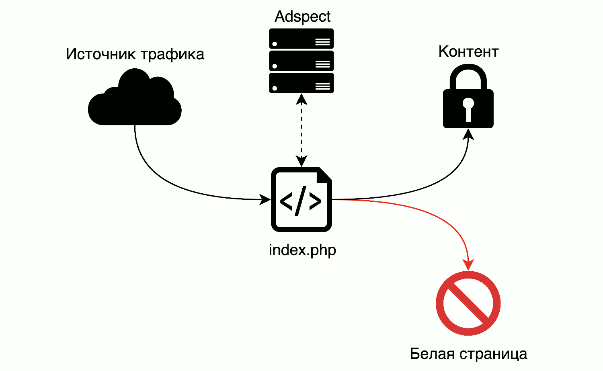

# Обзор

Adspect --- это простой в использовании облачный сервис, предназначенный для защиты онлайн-рекламных кампаний
(CPA-офферов, лэндингов) от нежелательного трафика. Под нежелательным трафиком мы понимаем:

* [скликивание (кликфрод)](https://ru.wikipedia.org/wiki/%D0%9A%D0%BB%D0%B8%D0%BA%D1%84%D1%80%D0%BE%D0%B4),
  повсеместно распространенное в медийных рекламных сетях и popunder-сетях;
* модераторов рекламных сетей;
* роботов spy-сервисов («spy services» --- сервисы для отслеживания чужих рекламных кампаний);
* [роботов для веб-скрейпинга](https://ru.wikipedia.org/wiki/%D0%92%D0%B5%D0%B1-%D1%81%D0%BA%D1%80%D0%B5%D0%B9%D0%BF%D0%B8%D0%BD%D0%B3);
* [роботов для подбора паролей](https://en.wikipedia.org/wiki/Credential_stuffing);
* роботов антивирусных компаний;
* и другие разновидности нецелевых или откровенно враждебных посетителей.

Мы работаем со всеми источниками трафика, как существующими, так и теми, которые только появятся
в будущем --- наши алгоримты фильтрации трафика абсолютно универсальны и одинаково эффективно обрабатывают
любой трафик, откуда бы он ни поступал. Мы работаем с ведущими рекламными сетями, в том числе:

* Google Ads
* Microsoft Advertising (Bing Ads)
* Facebook
* Instagram
* VK
* Рекламная Сеть Яндекса
* myTarget
* ZeroPark
* ExoClick
* Taboola
* MGID
* PropellerAds
* TrafficStars
* и сотнями других

Мы защищаем ваши лэндинги и офферы от различных антивирусных, ИБ и скоринговых компаний, в том числе:

* GeoEdge
* Adscore
* Google Safe Browsing
* Kaspersky Labs
* Avast
* Forcepoint
* и многих других

Разделение трафика осуществляется при помощи специального файла, именуемого здесь и далее `index.php`, который
вы размещаете в папке лэндинга или в любом другом месте, доступном по протоколу HTTP. Этот файл выступает в роли
точки входа для вашего трафика и работает в паре с нашими серверами, которые уже непосредственно выполняют
фильтрацию. В зависимости от принятого нашими фильтрами решения, посетитель может быть направлен на ваш контент
(оффер, лэндинг) или на так называемую «белую страницу» --- страницу, которая не содержит никакого чувствительного
к несанкционированному доступу содержимого. Другими словами, Adspect выступает в роли промежуточного этапа на пути
прохождения трафика, осуществляя отсев нежелательных посетителей от целевых в реальном времени.

Несколько одинаковых файлов `index.php` могут использоваться параллельно для защиты нескольких офферов или лэндингов,
при этом не мешая друг другу.

## index.php

`index.php` --- это PHP-скрипт, который является связующим звеном между вашим хостом и нашими бэкенд-серверами.
Имя файла `index.php` является лишь принятым обозначением, которое мы используем в Adspect, однако вы можете
переименовывать эти файлы так, как вам угодно. Так как скрипт `index.php` написан на PHP, то это автоматически
означает необходимость в хостинге с поддержкой PHP или в трекере, поддерживающем загрузку PHP-лэндингов. По этой
причине, в частности, трекер Keitaro TDS не подходит для размещения `index.php`, так как не поддерживает PHP
на уровне загружаемых лэндингов.

Сам скрипт специально написан таким образом, чтобы быть совместимым с практически любыми хостинг-провайдерами,
начиная от виртуальных хостингов и VPS и заканчивая выделенными серверами и Amazon AWS. Поддерживаются как
Windows, так и Unix-подобные операционные системы, в пределах их поддержки самим PHP. PHP 7 рекомендуется,
PHP 5 поддерживается, PHP 4 *вероятно* также работает, но его поддержка не тестировалась и не будет тестироваться.
Используйте самую свежую версию PHP, которая доступна.

Единственным требованием к PHP является [поддержка cURL](https://www.php.net/manual/ru/book.curl.php). Вы можете
проверить, поддерживается ли cURL вашей сборкой PHP, используя информацию из [phpinfo](https://www.php.net/manual/ru/function.phpinfo.php);
cURL поддерживается подавляющим большинством работающих ныне сборок PHP.

## Хостинг

Мы рекомендуем использовать хостинг от [Inferno Solutions](https://cp.inferno.name/aff.php?aff=2952) из-за
качественного обслуживания, ориентированности на русскоязычных клиентов и отсутствия необходимости предъявлять
документы или иные личные данные (нет KYC).

Предлагаем вам воспользоваться нашими скидочными купонами:

* **ADSPECT25VPS** --- скидка 25% на первый платеж для всех VPS за период 1, 3, 6 месяцев;
* **ADSPECT25SSDVPS** --- скидка 25% на первый платеж для всех SSD VPS за период 1, 3, 6 месяцев;
* **ADSPECT25SSDVPSRU** --- скидка 25% на первый платеж для всех SSD VPS в России;
* **ADSPECT15SSDVPSPL** --- скидка 15% на первый платеж для всех SSD VPS в Польше;
* **ADSPECT15DEDI** --- скидка $15 на первый платеж для выделенных серверов RU-xx и NL3-xx.

## Порядок работы

Типичный порядок работы с Adspect для защиты рекламных кампаний в партнерском маркетинге выглядит следующим образом:

1. [Создаете поток](streams.md) в Adspect и переводите его в режим «Модерация»;
2. Скачиваете файл `index.php`, привязанный к этому потоку;
3. Размещаете `index.php` в корневой папке вашего лэндинга, либо в другом месте, доступном извне;
4. Создаете рекламную кампанию, используя в качестве рекламной ссылки ссылку на файл `index.php`;
5. Ожидаете одобрения вашей кампании модерацией рекламной сети и переключаете поток в режим «Фильтр»;
6. Льете трафик и анализируете его показатели в разделе [«Статистика»](reporting.md).

Мы остановимся на тонкостях отдельных шагов этом процессе в следующих главах настоящего руководства.
